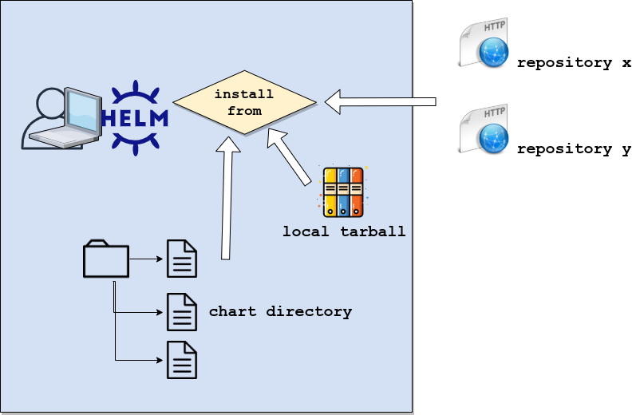
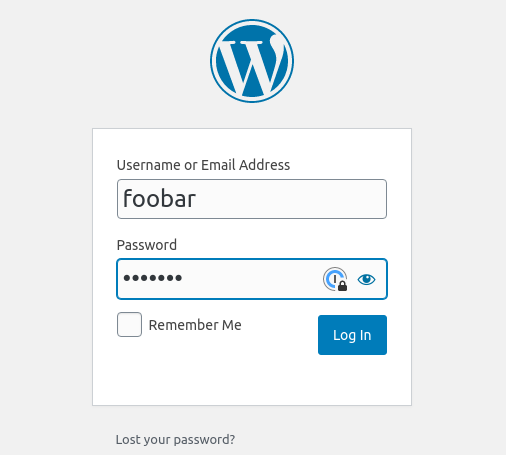
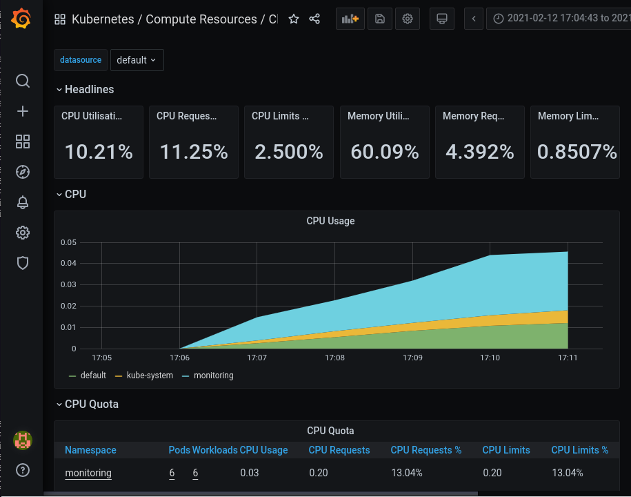

## Looking for a chart

Helm works with what is called a “**chart**”. A chart is basically a package of yaml resources that support a **templating language**.

Before building our own chart we should always have a look of what is available in the community. There are often charts that fits our needs.

These charts can be installed from different sources: a Helm chart repository, a local archive or chart directory.



First of all, let’s say that we want to install a `Wordpress` instance on an empty infrastructure.

We’ll need to provision a database as well as the Wordpress application.

Let’s look for a wordpress chart !

If you just installed Helm, your repositories list should be empty

```console
$ helm repo list
```

We’re going to check what are the Wordpress charts available in the **[artifacthub](https://artifacthub.io/).**

You can either browse from the web page or use the command

```console
$ helm search hub wordpress
URL                                                     CHART VERSION   APP VERSION     DESCRIPTION
https://artifacthub.io/packages/helm/bitnami/wo...      10.6.4          5.6.1           Web publishing platform for building blogs and ...
https://artifacthub.io/packages/helm/groundhog2...      0.2.6           5.6.0-apache    A Helm chart for Wordpress on Kubernetes
https://artifacthub.io/packages/helm/seccurecod...      2.4.0           4.0             Insecure & Outdated Wordpress Instance: Never e...
https://artifacthub.io/packages/helm/presslabs/...      0.10.5          0.10.5          Presslabs WordPress Operator Helm Chart
```

Using the Hub there are a few things that can help to choose the best option.

First of all the number of **stars** obviously and whether the artifact comes from a **verified** publisher or **signed** by the maintainer.

 

We’ll get the one provided by Bitnami. In the [chart page](https://artifacthub.io/packages/helm/bitnami/wordpress) you’ll be guided with the commands to add Bitnami’s repository.

```console
$ helm repo add bitnami https://charts.bitnami.com/bitnami
"bitnami" has been added to your repositories

helm repo update
```

From now on we can install all the charts published by Bitnami:

```console
$ helm search repo bitnami
NAME                                    CHART VERSION   APP VERSION     DESCRIPTION
bitnami/bitnami-common                  0.0.9           0.0.9           DEPRECATED Chart with custom templates used in ...
bitnami/airflow                         8.0.3           2.0.1           Apache Airflow is a platform to programmaticall...
bitnami/apache                          8.2.3           2.4.46          Chart for Apache HTTP Server
bitnami/aspnet-core                     1.2.3           3.1.9           ASP.NET Core is an open-source framework create...
bitnami/cassandra                       7.3.2           3.11.10         Apache Cassandra is a free and open-source dist...
```

## Inspect the chart

OK let’s get back to what we want to achieve: Installing a Wordpress instance.

Now that we identified the chart, we’re going to check what it actually does. You should always **check** what will be installed.

* you can download the chart on your laptop and have a look to its content

```console
$ helm pull --untar bitnami/wordpress

$ tree -L 2  wordpress/
wordpress/
├── Chart.lock
├── charts
│   ├── common
│   └── mariadb
├── Chart.yaml
├── ci
│   ├── ct-values.yaml
│   ├── ingress-wildcard-values.yaml
│   ├── values-hpa-pdb.yaml
│   └── values-metrics-and-ingress.yaml
├── README.md
├── templates
│   ├── configmap.yaml
…
│   ├── tests
│   └── tls-secrets.yaml
├── values.schema.json
└── values.yaml
```

* read carefully the readme
* check what are the dependencies pulled by this chart

```console
$ helm show chart bitnami/wordpress
annotations:
  category: CMS
apiVersion: v2
appVersion: 5.6.1
dependencies:
- condition: mariadb.enabled
  name: mariadb
  repository: https://charts.bitnami.com/bitnami
  version: 9.x.x
- name: common
  repository: https://charts.bitnami.com/bitnami
  tags:
  - bitnami-common
  version: 1.x.x
...

```

**Note**: that the wordpress chart defines the [mariadb chart](https://artifacthub.io/packages/helm/bitnami/mariadb) as dependency

* Look at the **available values**

```console
$ helm show values bitnami/wordpress
```

## Our first release

Our next step will be to set **our desired values**. Indeed you mentioned that Helm uses a templating language to render the manifests. This will help us to configure our instance according to our environment.

* no persistency at all, this is just a workshop
* 2 replicas for the wordpress instance
* a database named “foodb”
* an owner “foobar” for this database
* passwords

All the charts have a file named **values.yaml** that contains the default values.

These values can be overridden at the command line with `--set` or we can put them in a yaml file that we’ll use with the `-f` parameter.

For this exercise we’ll create a file named “**override-values.yaml**” and we’ll use the command line for sensitive information.

```yaml
wordpressUsername: foobar
wordpressPassword: ""
wordpressBlogName: Foo's Blog!
replicaCount: 2
persistence:
  enabled: false
service:
  type: ClusterIP
mariadb:
  auth:
    rootPassword: ""
    database: foodb
    username: foobar
    password: ""
  primary:
    persistence:
      enabled: false
```

**Note**: In order to define the values of a **subchart** you must put the chart name as the first key. here `mariadb.values` of the mariadb chart.

Here we go!

First of all we’ll run it in dry-run mode in order to check the yaml rendering (be careful, the passwords are printed in plain text)

```console
$ helm install foo-blog bitnami/wordpress \
-f override-values.yaml \
--set mariadb.auth.rootPassword=r00tP4ss \
--set mariadb.auth.password=us3rP4ss \
--set wordpressPassword=azerty123 \
--dry-run
```

Another word you need to know is **Release**.

“A Release is an instance of a chart running in a Kubernetes cluster”. Our release name here is **foo-blog**

If the output looks OK we can install our wordpress, just remove the `--dry-run` parameter

```console
$ helm install foo-blog bitnami/wordpress -f override-values.yaml --set mariadb.auth.rootPassword="r00tP4ss" --set mariadb.auth.password="us3rP4ss" --set wordpressPassword="azerty123"
NAME: foo-blog
LAST DEPLOYED: Fri Feb 12 16:33:21 2021
NAMESPACE: default
STATUS: deployed
REVISION: 1
NOTES:
** Please be patient while the chart is being deployed **

Your WordPress site can be accessed through the following DNS name from within your cluster:

    foo-blog-wordpress.default.svc.cluster.local (port 80)

To access your WordPress site from outside the cluster follow the steps below:

1. Get the WordPress URL by running these commands:

  NOTE: It may take a few minutes for the LoadBalancer IP to be available.
        Watch the status with: 'kubectl get svc --namespace default -w foo-blog-wordpress'

   export SERVICE_IP=$(kubectl get svc --namespace default foo-blog-wordpress --template "{{ range (index .status.loadBalancer.ingress 0) }}{{.}}{{ end }}")
   echo "WordPress URL: http://$SERVICE_IP/"
   echo "WordPress Admin URL: http://$SERVICE_IP/admin"

2. Open a browser and access WordPress using the obtained URL.

3. Login with the following credentials below to see your blog:

  echo Username: foobar
  echo Password: $(kubectl get secret --namespace default foo-blog-wordpress -o jsonpath="{.data.wordpress-password}" | base64 --decode)
```

When the release has been successfully installed you’ll get the above “**NOTES**” that are very useful to get access to your application. You just have to copy/paste.

But first of all we’re going to check that the pods are actually running

```console
$ kubectl get deploy,sts
NAME                                    READY   UP-TO-DATE   AVAILABLE   AGE
deployment.apps/foo-blog-wordpress   2/2     2            2           55m

NAME                                   READY   AGEkubectl get deploy,sts
statefulset.apps/foo-blog-mariadb   1/1     55m
```

We didn’t define an ingress for the purpose of the workshop, therefore we’ll use a port-forward

```console
$ kubectl port-forward svc/foo-blog-wordpress 9090:80
```

Then open a browser using the URL [http://localhost:9090/admin](http://localhost:8080/admin), you’ll be prompted to fill in the credentials you defined above. (wordpressPassword)



We’ll check the database credentials too as follows

```console
$ MARIADB=$(kubectl get po -l app.kubernetes.io/name=mariadb -o jsonpath='{.items[0].metadata.name}')
```

```console
$ kubectl exec -ti ${MARIADB} -- bash -c 'mysql -u foobar -pus3rP4ss'
Welcome to the MariaDB monitor.  Commands end with ; or \g.
Your MariaDB connection id is 372
Server version: 10.5.8-MariaDB Source distribution

Copyright (c) 2000, 2018, Oracle, MariaDB Corporation Ab and others.

Type 'help;' or '\h' for help. Type '\c' to clear the current input statement.

MariaDB [(none)]> SHOW GRANTS;
+-------------------------------------------------------------------------------------------------------+
| Grants for foobar@%                                                                                   |
+-------------------------------------------------------------------------------------------------------+
| GRANT USAGE ON *.* TO `foobar`@`%` IDENTIFIED BY PASSWORD '*CD5BE357349BDA710A444B0BD741E8EB12B8BC2C' |
| GRANT ALL PRIVILEGES ON `foodb`.* TO `foobar`@`%`                                                    |
+-------------------------------------------------------------------------------------------------------+
2 rows in set (0.000 sec)
```

Delete the wordpress release

```console
$ helm uninstall foo-blog
```

## Deploy a complete monitoring stack with a single command!

The purpose of this step is to show that, even if the stack is composed of dozens of manifest, Helm makes things easy.

```console
$ helm repo add prometheus-community https://prometheus-community.github.io/helm-charts
"prometheus-community" has been added to your repositories

helm repo update
```

```console
$ helm install kube-prometheus prometheus-community/kube-prometheus-stack --create-namespace --namespace monitoring
NAME: kube-prometheus
LAST DEPLOYED: Fri Feb 12 18:03:05 2021
NAMESPACE: monitoring
STATUS: deployed
REVISION: 1
NOTES:
kube-prometheus-stack has been installed. Check its status by running:
  kubectl --namespace monitoring get pods -l "release=kube-prometheus"
```

Check that all the pods are running and run a port-forward

```console
$ kubectl port-forward -n monitoring svc/kube-prometheus-grafana 9090:80
```

Then open a browser using the URL [http://localhost:9090/admin](http://localhost:9090/admin)


**default credentials**: admin / prom-operator

You should browse a few minutes over all the dashboards available. There is pretty useful info.



You can then have a look to the resources that have been applied with a single command line as follows

```console
$ helm get manifest -n monitoring kube-prometheus
```

Well for a production ready prometheus we would have played a bit with the values but you get the point.

Delete the kube-prometheus stack

```console
$ helm uninstall  -n monitoring kube-prometheus
```
